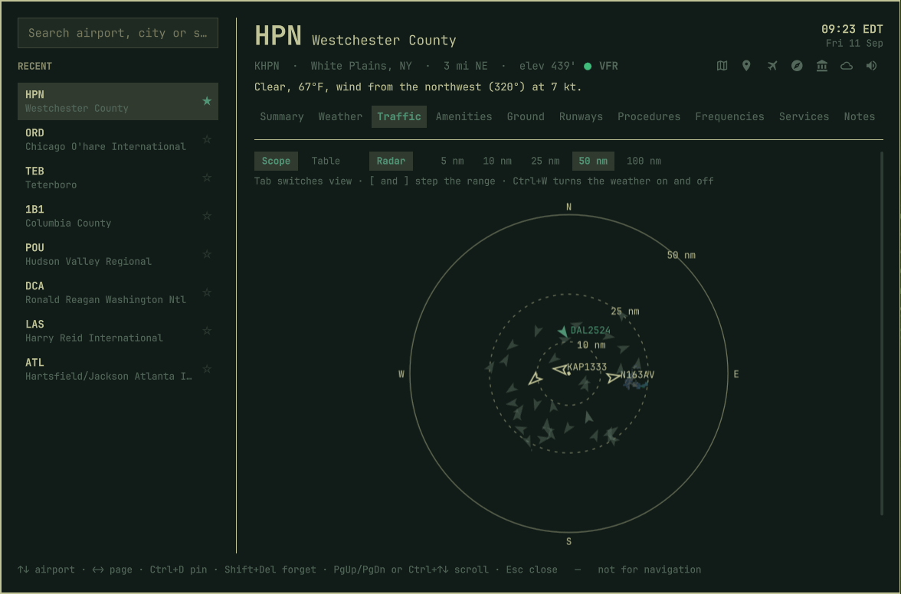

# Airport — an Omarchy shell plugin

Look up information about Airports.

*Currently, detailed information is only available for Airports in
the United States of America.*


## Install

```bash
omarchy plugin add https://github.com/derekwisong/omarchy-airport.git --enable
```

## Add a launcher

**A panel has no keybinding and no menu entry of its own.** Installing and enabling the plugin
puts nothing on your screen. Until you add one of the two below, the only way in is to type:

```bash
omarchy-shell shell toggle derekwisong.airport
```


### Menu entry, no keybinding

Open your menu extensions file:

```bash
$EDITOR ~/.config/omarchy/extensions/omarchy-menu.jsonc
```

Paste this block inside the outermost `{ }`, next to whatever is already there:

```jsonc
"trigger.airport": {
  "icon": "󰀝",
  "label": "Airport",
  "aliases": ["airport", "airports", "metar", "wx"],
  "description": "Look up any airport - runways, frequencies, weather, procedures",
  "action": "omarchy-shell shell toggle derekwisong.airport"
},
```

Save. The menu hot-reloads. Press `SUPER + SPACE`, type `airport`, press Enter. The same block
lives in [`menu-extension.jsonc`](menu-extension.jsonc) if you would rather copy it from a file.

### Keybinding

Add one line to `~/.config/hypr/bindings.lua`:

```lua
o.bind("SUPER + A", "Airport", "omarchy-shell shell toggle derekwisong.airport")
```

Save; Hyprland reloads itself. `SUPER + A` is free on a stock Omarchy — `omarchy menu
keybindings --print` shows what yours has already spent.

### Removing it

```bash
omarchy plugin remove derekwisong.airport
rm -rf ~/.cache/airport-info ~/.local/share/airport-info ~/.local/state/airport-info
```

Then delete whichever launcher you added.

## The panel

Left rail is recents, pinned first. The header — identifier, name, location, local time,
conditions and the links out — stays put on every page.

| Page | What's there |
|---|---|
| **Summary** | Runway, tower, hours, airspace, fuel, landing fee, sectional and centre, a forecast band, FAA delay programs and restrictions within 50 nm |
| **Weather** | Category, conditions in words, wind, visibility, sky, ceiling, temperature, dew point, altimeter, pressure and density altitude, twilight, a forecast timeline, raw METAR and TAF |
| **Traffic** | What ADS-B hears nearby — arriving, departing, on the ground, passing over — as a plan-view scope or a table, at 5 to 100 nm, over the NWS reflectivity mosaic |
| **Amenities** | Food, shops and lounges by concourse, filterable, with gate, step-free access and wi-fi, each linking to Google Maps |
| **Ground** | How you leave: rail, the airport's own people mover, buses, taxi ranks, car rental, ferries, bike share — each with the walk from the terminal |
| **Runways** | Which runway the wind favours, then per end: head and crosswind components, length, surface, lighting, alignment, ILS, VGSI, displaced thresholds, obstructions |
| **Procedures** | Approaches by runway, SIDs, STARs, ODPs, minimums, hot spots |
| **Frequencies** | The ones you'd tune, with tower hours; approach and departure filed separately |
| **Services** | Website, attended hours, parking, customs, repairs, oxygen, manager, owner, FBOs with fuel prices |
| **Notes** | Your markdown  notes |



## Keyboard

| Key | Does |
|---|---|
| `↑` `↓` | Move through the list |
| `←` `→` | Change page |
| `Enter` | Pick the highlighted airport |
| `Ctrl+D` | Pin / unpin |
| `Shift+Del` | Forget a recent |
| `PgUp` `PgDn`, `Ctrl+↑` `Ctrl+↓` | Scroll |
| `Ctrl+Home` `Ctrl+End` | Top / bottom |
| `Tab` | On Amenities, walk the concourse filter; on Traffic, switch scope / table |
| `[` `]` | On Traffic, step the range |
| `Ctrl+W` | On Traffic, weather radar under the scope |
| `Ctrl+O` | Open the airport's own website |
| `i` | Invert a chart, for night use |
| `Esc` | Back out of a chart, then close |

## The cache

Every FAA source is a bulk publication — there is no per-airport endpoint — so the plugin
downloads one 28-day cycle and indexes it. **About 9 seconds and 54 MB**, built the first time
you open the panel and again when the cycle rolls over. Worldwide runway data is fetched only
if you look up a non-US field. An airport then draws in two passes: everything local in about
75 ms, then conditions and delays when the network answers, the panel saying which it is
waiting on rather than going blank.

## The engine

`scripts/apt.py` is stdlib-only Python 3 and works standalone; the QML shells out to it.
`--json` on any subcommand.

```bash
apt=~/.config/omarchy/plugins/derekwisong.airport/scripts/apt.py

python3 $apt cache status               python3 $apt cache update
python3 $apt info KPOU                  python3 $apt wx KPOU
python3 $apt runways KPOU --svg         python3 $apt outlook KORD
python3 $apt procedures KATL            python3 $apt status DCA
python3 $apt amenities ATL              python3 $apt fbo KPOU
python3 $apt ground KATL                python3 $apt radar KATL --range 25
python3 $apt traffic KPOU --radius 40   python3 $apt tfr KEWR --radius 50
python3 $apt nearby KPOU --radius 50 --fuel
python3 $apt notes ATL add "Sky Club F is the good one"
```

Notes are markdown in `~/.local/share/airport-info/notes/<IDENT>.md`. Recents live in
`~/.local/state/airport-info/`.


## Not for navigation

**Get an official briefing before any flight.**

## Also here

- [Data sources](docs/data-sources.md) — every feed the plugin reads, and its terms. All public
  and unauthenticated: no account, no API key.
- [Development](docs/development.md) — running from a working tree, and the test suite.

## License

MIT — see [LICENSE](LICENSE). That covers the code, not the data it reads.

