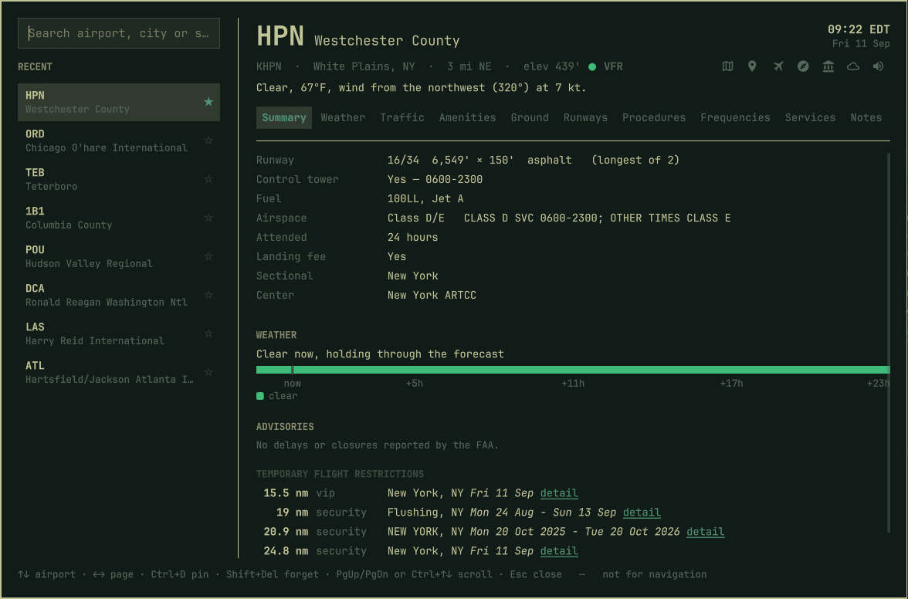
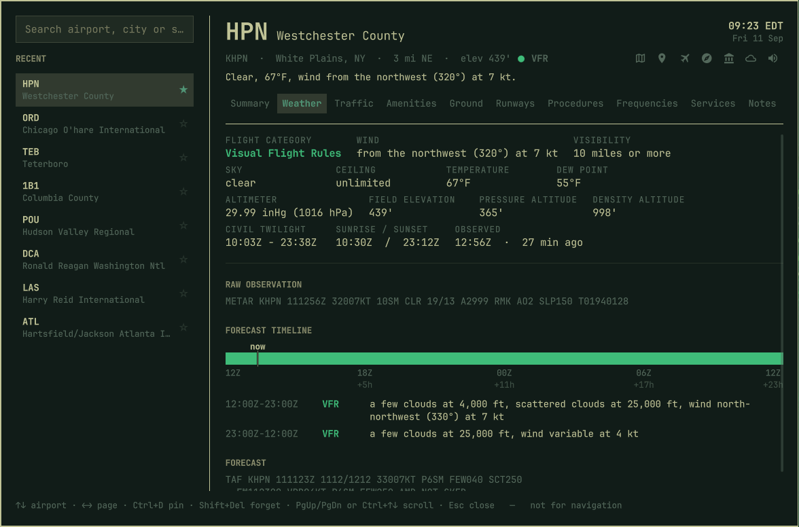

# Airport — an Omarchy shell plugin

Look up any of 19,411 US airports, and the rest of the world besides. One summoned panel:
type an identifier, a city or a state.



## Install

```bash
omarchy plugin add https://github.com/derekwisong/omarchy-airport.git --enable
omarchy-shell shell toggle derekwisong.airport
```

Needs Python 3 — standard library only, nothing to `pip install`, nothing to install as root.

Approach plates and diagrams are shown inside the panel where Qt's PDF module is available,
and open in your browser where it is not. Either way there is nothing to set up.

### Reaching it

`SUPER + SPACE` then "airport", once you copy the entry from
[`menu-extension.jsonc`](menu-extension.jsonc) into
`~/.config/omarchy/extensions/omarchy-menu.jsonc` (hot-reloads on save). Or bind a key:

```lua
-- ~/.config/hypr/bindings.lua
o.bind("SUPER + <key>", "Airports", "omarchy-shell shell toggle derekwisong.airport")
```

The plugin writes nothing to your config.

### Removing it

```bash
omarchy plugin remove derekwisong.airport
rm -rf ~/.cache/airport-info ~/.local/share/airport-info ~/.local/state/airport-info
```

## The panel

Left rail is recents, pinned first. The header — identifier, name, location, conditions and
the links out — stays put on every page.

| Page | What's there |
|---|---|
| **Summary** | Runway, tower and hours, airspace, fuel, attended hours, landing fee, a forecast band, FAA delays and TFRs |
| **Weather** | Category, wind, visibility, sky, ceiling, temperature, dew point, altimeter, pressure and density altitude, twilight, a forecast timeline, raw METAR and TAF |
| **Amenities** | Food, shops and lounges by concourse, filterable, each linking to Google Maps |
| **Runways** | Which runway the wind favours, then every runway per end: lengths, surface, lighting, alignment, ILS, VGSI, displaced thresholds, LDA, obstructions, pattern altitude |
| **Procedures** | Approaches by runway, SIDs, STARs, ODPs, minimums, hot spots |
| **Frequencies** | The ones you'd tune, with tower hours; approach and departure filed separately |
| **Services** | Attended hours, parking, customs, manager, owner, FBOs with fuel prices |
| **Notes** | Your markdown, edited in your editor, live on save |

`i` inverts a chart for night use.



## Keyboard

| Key | Does |
|---|---|
| `↑` `↓` | Move through the list |
| `←` `→` | Change page |
| `Enter` | Pick the highlighted airport |
| `Ctrl+D` | Pin / unpin |
| `Shift+Del` | Forget a recent |
| `PgUp` `PgDn`, `Ctrl+↑` `Ctrl+↓` | Scroll |
| `Ctrl+Home` `Ctrl+End` | Top / bottom |
| `Tab` | On Amenities, walk the concourse filter |
| `Esc` | Back out of a chart, then close |

## The cache

Every FAA source is a bulk publication — there is no per-airport endpoint — so the plugin
downloads one 28-day cycle and indexes it. **About 9 seconds and 54 MB**, built the first time
you open the panel and again when the cycle rolls over. Worldwide runway data is fetched only
if you look up a non-US field.

```bash
apt=~/.config/omarchy/plugins/derekwisong.airport/scripts/apt.py
python3 $apt cache status
python3 $apt cache update
```

An airport draws in two passes: everything local in about 75 ms, then conditions and delays
when the network answers. The panel says which it is waiting on rather than going blank.

## The engine

`scripts/apt.py` is stdlib-only Python 3 and works standalone; the QML shells out to it.
`--json` on any subcommand.

```bash
python3 $apt info KPOU              python3 $apt outlook KORD
python3 $apt runways KPOU --svg     python3 $apt status DCA
python3 $apt procedures KATL        python3 $apt wx KPOU
python3 $apt amenities ATL          python3 $apt fbo KPOU
python3 $apt nearby KPOU --radius 50 --fuel
python3 $apt notes ATL add "Sky Club F is the good one"
```

Notes are markdown in `~/.local/share/airport-info/notes/<IDENT>.md`. Recents live in
`~/.local/state/airport-info/`.

## What it will not tell you

- **No NOTAMs.** No key-free source exists, so it does not have them and does not link to a
  search that would imply it had checked.
- **No ratings.** OpenStreetMap has no rating field. Names link to Google Maps, where they are.
- **TFRs are counted, not located.** The FAA publishes geometry per-NOTAM only, so it reports
  how many are active in the state and links to the list.
- **Outside FAA coverage it says so** rather than reporting no tower or no fuel.
- **Delays are what the FAA reports**, not a prediction. A forecast is a forecast.

## Not for navigation

Built on a 28-day snapshot. Every pilot-facing output names its cycle. Verify against current
FAA publications and get an official preflight briefing before any flight.

## Development

Symlink the repo in and the shell loads from your working tree:

```bash
ln -s "$PWD" ~/.config/omarchy/plugins/derekwisong.airport
omarchy-shell shell rescanPlugins
omarchy restart shell      # required to pick up QML changes
```

`omarchy plugin remove` unlinks rather than deleting the target. To test what a user gets,
remove it and `omarchy plugin add .` instead.

```bash
./tests/smoke.sh              # 97 checks, network required
./tests/smoke.sh --with-osm   # adds Overpass and AirNav
omarchy plugin validate .
```

NASR rows are stored as positional arrays over the allowlists at the top of `apt.py`; a column
not on its list reads back as absent, so add it there and rebuild. Never name a QML property
`data` — `Item.data` is the default children list and shadows it silently.

## License

MIT — see [LICENSE](LICENSE). That covers the code, not the data below.

## Data sources

All public and unauthenticated. No account, no API key.

| Source | Provides | Terms |
|---|---|---|
| [FAA NASR](https://nfdc.faa.gov/) | Airports, runways, frequencies, airspace, attendance, contacts, remarks | Public domain |
| [FAA d-TPP](https://aeronav.faa.gov/) | Approaches, SIDs, STARs, ODPs, minimums, diagrams | Public domain |
| [FAA Chart Supplement](https://aeronav.faa.gov/) | Per-airport supplement pages | Public domain |
| [aviationweather.gov](https://aviationweather.gov/) | METAR, TAF, flight category | NOAA, public domain |
| [FAA NAS Status](https://nasstatus.faa.gov/) | Ground delays and stops, closures | Public domain |
| [FAA TFR](https://tfr.faa.gov/) | Active restrictions by state | Public domain |
| [OurAirports](https://ourairports.com/) | Worldwide airports and runways, IATA codes, search ranking | Public domain |
| [OpenStreetMap](https://www.openstreetmap.org/) via [Overpass](https://overpass-api.de/) | Terminal food, shops, lounges and their concourses | © OpenStreetMap contributors, **ODbL** |
| [AirNav](https://www.airnav.com/) | FBO names and fuel prices | © AirNav, LLC — one airport on demand, cached 24h |
| [sunrise-sunset.org](https://sunrise-sunset.org/) | Civil twilight, sunrise, sunset | Free public API |

OpenStreetMap attribution appears in the CLI output and on every generated page, not only here.
